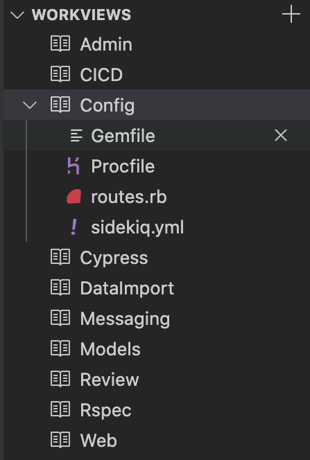

# Workviews

This extension allows you to quickly switch between sets of files (i.e. "workviews") within a VS Code window. 

Your active workview is automatically saved each time it is switched. The extension shows up in the "Explorer" tab and can be rearranged.

## Features

* Easily create a workview by clicking the "+" at the top right of the extension
* Autosaves current workview when a new workview is selected
* Keeps track of files relevant to a workview when they are opened and closed (also manually removable)
* Attempts to restore the tabs in the same grid position

## Extension Settings

This extension contributes the following settings:

* `workviews.state`: (readonly) The internal state of the extension, allowing workviews to be persisted

## Known Issues

* VS Code does not provide ability to directly access open editors at this time ([vscode #15178](https://github.com/Microsoft/vscode/issues/15178))

## Release Notes

### 1.1.0

Changed method of keeping track of relevant documents for a workviews
